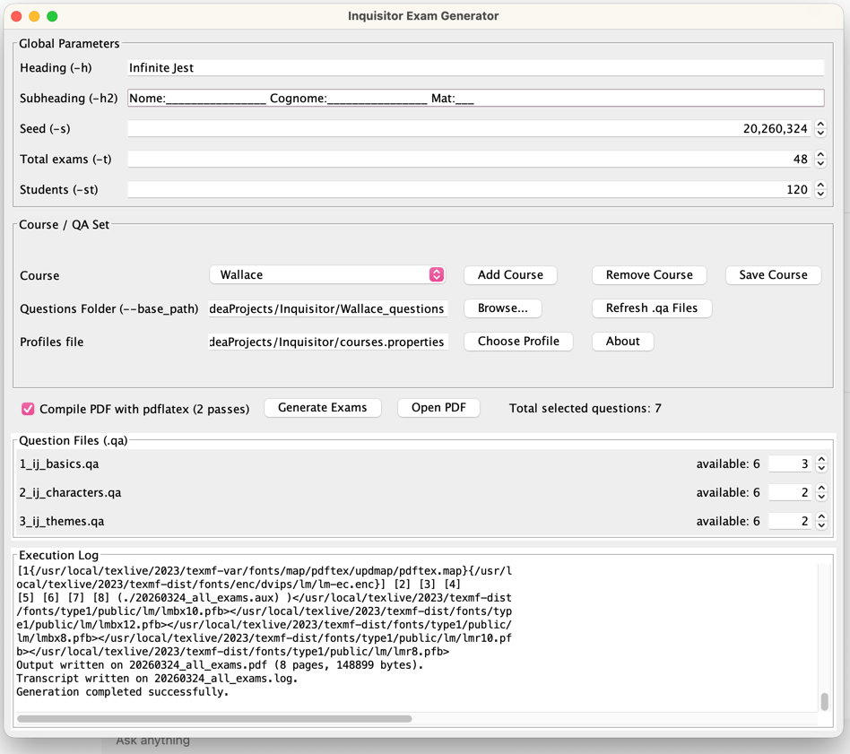

# Inquisitor



## Requirements

- JDK 17+ (`javac`, `jar`, `jpackage`)

## macOS

Build a self-contained `.app`:

```bash
./scripts/build_macos_app.sh
```

Generated app:

- `dist/Inquisitor.app`

Run from shell:

```bash
./scripts/launch_inquisitor.sh
```

Open from Finder:

```bash
./scripts/launch_inquisitor.sh --open
```

Auto-build + run:

```bash
./scripts/inquisitor
```

Supported env vars (`build_macos_app.sh`):

- `APP_NAME` (default: `Inquisitor`)
- `MAIN_CLASS` (default: `InquisitorSwingUI`)
- `JAR_NAME` (default: `Inquisitor.jar`)
- `DIST_DIR` (default: `./dist`)
- `ICON_PATH` (default: `./assets/Inquisitor.icns`, if present)

Supported env vars (`launch_inquisitor.sh`):

- `APP_NAME` (default: `Inquisitor`)
- `APP_PATH` (default: `./dist/<APP_NAME>.app`)

## Ubuntu/Linux

Build Linux app image (default):

```bash
./scripts/build_linux_app.sh
```

Run it:

```bash
./dist/Inquisitor/bin/Inquisitor
```

Build a `.deb` package instead:

```bash
PACKAGE_TYPE=deb ./scripts/build_linux_app.sh
```

Supported env vars (`build_linux_app.sh`):

- `APP_NAME` (default: `Inquisitor`)
- `MAIN_CLASS` (default: `InquisitorSwingUI`)
- `JAR_NAME` (default: `Inquisitor.jar`)
- `DIST_DIR` (default: `./dist`)
- `ICON_PATH` (default: `./assets/Inquisitor.png`, if present)
- `PACKAGE_TYPE` (default: `app-image`, optional `deb`)

## Default Course Data

Packaged app builds include:

- `courses.properties`
- `Wallace_questions/`
- `Lynch_questions/`
